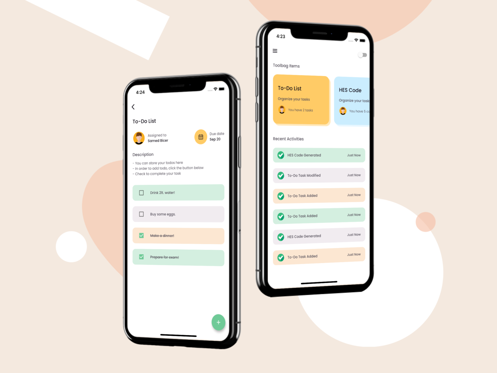
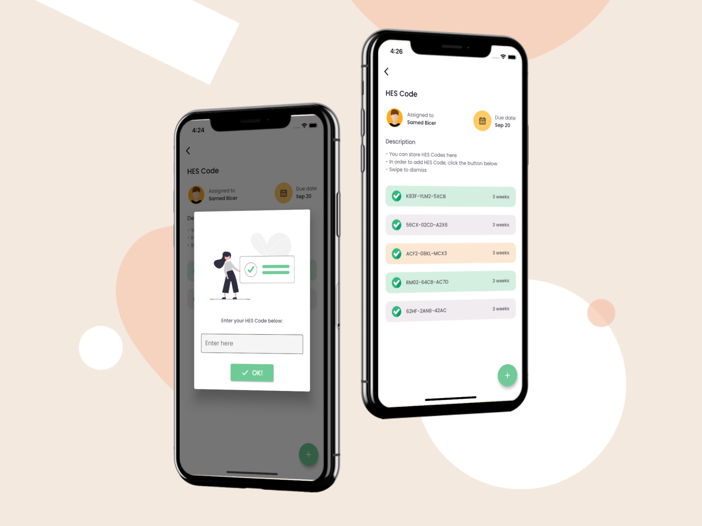
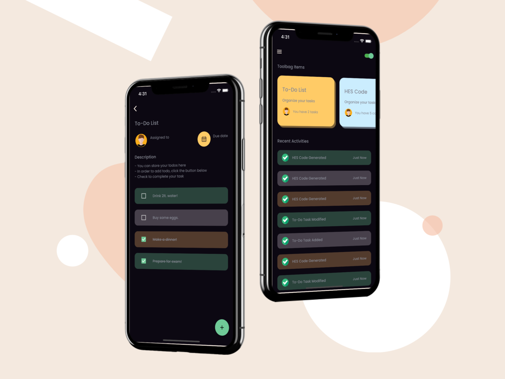

# PersonalToolbag Application

A Flutter project that tries to makes your Toolbag tidier. I've tried to make well organized Flutter project with Firebase and good UI.

## Getting Started

In order to run the project, you need to implement your own Firebase Firestore configuration files.
- Android: add ```google-services.json``` into ```android/app/``` folder.
- iOS: add ```GoogleService-Info.plist``` into ```ios/``` folder.

**Packages we are using:**

- flutter_svg
- provider
- firebase_core
- cloud_firestore
- cupertino_icons

## Photos
### Light Theme


### Dark Theme

